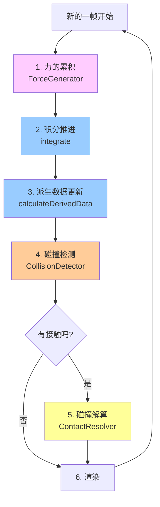
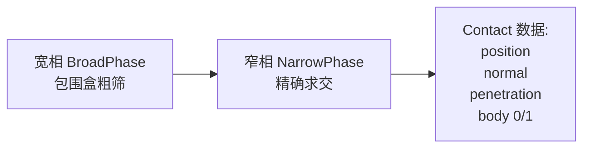
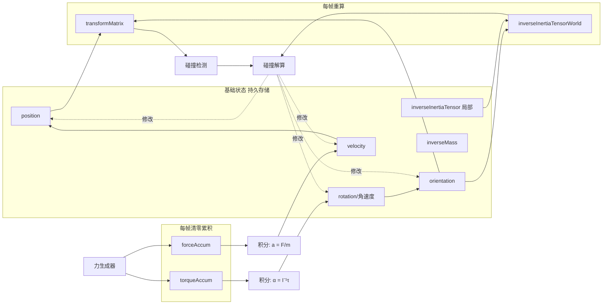

# 刚体物理模拟全流程（鸟瞰图）

> 本笔记作为 Cyclone 物理引擎的"全景索引"，把分散在 9-17 章的知识点串成一条流水线。
> 每一步都标注了对应的源码位置和详细笔记跳转点。

---

## 一、一帧物理模拟的总览



**6 个步骤分两组**：
- **前 3 步**（力 → 积分 → 派生）：物体的"独立运动"，每个物体互不干扰
- **后 3 步**（检测 → 解算 → 渲染）：物体间的"相互作用"和呈现

---

## 二、各步骤详解

### Step 1️⃣ 力的累积（Force Accumulation）

每帧开始时清零累积器，然后遍历所有"力生成器"，把力和力矩累加到刚体上。

```cpp
forceAccum  = 0;   // 清零
torqueAccum = 0;
for (auto& generator : forceGenerators) {
    generator.updateForce(body, duration);
    // 内部调用 body->addForceAtPoint(force, point)
}
```

**典型力源**：
| 力源 | 是否产生力矩 | 备注 |
|------|------------|------|
| 重力 | 否 | 直接加在 `forceAccum`，作用于质心 |
| 弹簧 | 是 | 作用点偏离质心 → 同时产生力和力矩 |
| 浮力 | 是 | 作用点在浮心，与质心可能不重合 |
| 空气阻力 | 是 | 与速度反向 |
| 推进器 | 是 | 飞机引擎、火箭推进 |

**核心公式**：

$$\vec{\tau} = \vec{r} \times \vec{F}$$

> 源码：[body.cpp](../../src/body.cpp) 的 `addForce`、`addForceAtPoint`、`addForceAtBodyPoint`
> 章节：第 9-11 章（力生成器、刚体力学）

---

### Step 2️⃣ 积分推进（Numerical Integration）

把累积的力转化为速度变化，速度转化为位置变化——**这是把"运动定律"离散化的核心**。

```cpp
// 平移部分：F = ma
Vector3 linearAcc = forceAccum * inverseMass;
velocity += linearAcc * duration;
velocity *= pow(linearDamping, duration);  // 阻尼
position += velocity * duration;

// 旋转部分：τ = Iα
Vector3 angularAcc = inverseInertiaTensorWorld.transform(torqueAccum);
rotation += angularAcc * duration;
rotation *= pow(angularDamping, duration);
orientation.addScaledVector(rotation, duration);  // 四元数积分
orientation.normalise();  // 防漂移
```

**平移与旋转的对偶**：

| 平移 | 旋转 | 对应符号 |
|------|------|---------|
| 力 → 加速度 | 力矩 → 角加速度 | $\vec{F}/m$ vs $\mathbf{I}^{-1}\vec{\tau}$ |
| 位置 / 速度 | 姿态 / 角速度 | $\vec{p},\vec{v}$ vs $\vec{q},\vec{\omega}$ |
| 直接相加 | 四元数微分 | $p+v\Delta t$ vs $q + \frac{1}{2}\omega q \Delta t$ |

> 用的是**半隐式欧拉法**（先更新速度，再用新速度更新位置）——简单且能量较稳定。
> 源码：`RigidBody::integrate`（body.cpp）
> 章节：第 6-9 章（积分器、刚体动力学）

---

### Step 3️⃣ 派生数据更新（Derived Data）

由"基础状态"算出"衍生状态"，供后续使用：

```cpp
void RigidBody::calculateDerivedData() {
    orientation.normalise();
    
    // 1. 由 (position, orientation) 算变换矩阵
    _calculateTransformMatrix(transformMatrix, position, orientation);
    
    // 2. 把局部逆惯性张量变换到世界坐标
    _transformInertiaTensor(
        inverseInertiaTensorWorld,
        orientation,
        inverseInertiaTensor,   // I⁻¹_body
        transformMatrix);       // 内部用 R·I⁻¹·R^T
}
```

| 基础状态（输入） | 派生状态（输出） |
|----------------|-----------------|
| `position`、`orientation` | `transformMatrix`（4×3 变换矩阵） |
| `inverseInertiaTensor`（局部，固定） | `inverseInertiaTensorWorld`（每帧重算） |

**为什么独立这一步？** 后面的碰撞检测、碰撞解算都需要"世界坐标的物体形态"——把这部分预先算好，避免重复计算。

> 源码：`RigidBody::calculateDerivedData`（body.cpp）
> 关键概念：惯性张量的相似变换 $\mathbf{I}^{-1}_{world} = \mathbf{R} \cdot \mathbf{I}^{-1}_{body} \cdot \mathbf{R}^T$

---

### Step 4️⃣ 碰撞检测（Collision Detection）

遍历所有几何体，找出**穿透或贴近**的物体对，输出 `Contact` 数据。



**Cyclone 中的实现**：
- **宽相**（第 12 章）：包围球 / AABB / BVH 树
- **窄相**（第 13 章）：球-球、球-平面、盒-盒（SAT 分离轴定理）等

**Contact 数据结构**：

```cpp
class Contact {
    RigidBody* body[2];          // 参与碰撞的两物体
    Vector3 contactPoint;        // 世界坐标接触点
    Vector3 contactNormal;       // 法线方向（指向 body[0] 外）
    real    penetration;         // 穿透深度
    real    friction, restitution;
};
```

> 源码：[collide_coarse.h](../../include/cyclone/collide_coarse.h)、[collide_fine.h](../../include/cyclone/collide_fine.h)
> 章节：第 12 章（宽相检测）、第 13 章（窄相检测）

---

### Step 5️⃣ 碰撞解算（Contact Resolution）⭐ 核心

这是整个流水线**最复杂**的一步，分三个子阶段：

#### 5.1 prepareContacts（预计算）

为每个 Contact 算出后续需要的辅助数据：

```cpp
calculateContactBasis();         // 接触坐标系（X=法线）
relativeContactPosition[i] = contactPoint - body[i]->position;
contactVelocity = calculateLocalVelocity(...);    // 含 v + ω×r
desiredDeltaVelocity = -(1+c) * contactVelocity.x;
```

#### 5.2 adjustPositions（穿透解算）— 14.3

迭代解算最严重的穿透，按"线性惯性 vs 角度惯性"比例**同时挪位置和转姿态**：

```cpp
while (有未解的严重穿透 && iter < limit) {
    找最严重的接触 i;
    applyPositionChange(i);              // 非线性投影
    更新所有共享 body 的接触的 penetration;
}
```

#### 5.3 adjustVelocities（速度解算）— 14.2

迭代解算最严重的"闭合速度"，用**冲量法**同时改变线速度和角速度：

```cpp
while (有未解的严重闭合速度 && iter < limit) {
    找最严重的接触 i;
    applyVelocityChange(i);              // 6步流水线
    更新所有共享 body 的接触的 contactVelocity;
}
```

> 源码：[contacts.cpp](../../src/contacts.cpp) 的 `ContactResolver::resolveContacts`
> 详细笔记：[第14章-碰撞解算与延伸知识.md](./第14章-碰撞解算与延伸知识.md)

**为什么位置和速度要分开解算？**
- 速度解算是**真物理**（动量守恒、恢复系数），穿透解算是**视觉补救**（凭空挪动位置）
- 合并会导致数值不稳定（位置变 → 速度变 → 穿透又变 → 死循环）
- 顺序"先位置后速度"避免下一帧重复触发碰撞

---

### Step 6️⃣ 渲染（Rendering）

物理状态稳定后，用 `transformMatrix` 把模型矩阵传给渲染器：

```cpp
GLfloat mat[16];
body->getGLTransform(mat);
glMultMatrixf(mat);
drawMesh();
```

> 源码：各 demo 目录下的 `*.cpp` 主程序

---

## 三、数据流图：基础状态 → 派生状态 → 反馈



---

## 四、所有步骤的"双轨制"结构

刚体物理的精髓在于：**平移和旋转是完全平行的两套数学**，一一对应。

| 平移轨道 | 旋转轨道 | 阶段 |
|---------|---------|------|
| 力 $\vec{F}$ | 力矩 $\vec{\tau}$ | Step 1 累积 |
| $a = F/m$ | $\alpha = \mathbf{I}^{-1}\tau$ | Step 2 积分 |
| 速度 $\vec{v}$ | 角速度 $\vec{\omega}$ | Step 2 积分 |
| 位置 $\vec{p}$ | 姿态 $\vec{q}$（四元数） | Step 2 积分 |
| 冲量 $\vec{g}$ | 冲量力矩 $\vec{u} = \vec{r} \times \vec{g}$ | Step 5 解算 |
| $\Delta v = g/m$ | $\Delta\omega = \mathbf{I}^{-1}u$ | Step 5 解算 |
| 线性惯性 $1/m$ | 角度惯性 $(r \times n)^T \mathbf{I}^{-1} (r \times n)$ | Step 5 分配 |

> 这种"双轨制"是理解刚体物理最重要的思维框架——一旦你掌握了平移侧，把所有量"翻译"成旋转侧的对应物，就理解了一半。

---

## 五、Cyclone 主循环代码

把上面所有步骤翻译成代码：

```cpp
void runFrame(float duration) {
    // ===== 物理积分阶段 =====
    for (auto* body : bodies) {
        body->clearAccumulators();           // Step 0: 清零累积器
    }
    
    for (auto& gen : forceGenerators) {      // Step 1: 累积力/力矩
        gen.updateForce(body, duration);
    }
    
    for (auto* body : bodies) {              // Step 2-3: 积分 + 派生
        body->integrate(duration);
        // integrate 内部最后调用了 calculateDerivedData()
    }
    
    // ===== 碰撞处理阶段 =====
    contacts.clear();
    collisionDetector.detect(bodies, contacts);  // Step 4: 检测
    
    if (!contacts.empty()) {
        contactResolver.resolveContacts(         // Step 5: 解算
            contacts.data(),
            contacts.size(),
            duration);
    }
    
    // ===== 渲染阶段 =====
    render();                                // Step 6
}
```

---

## 六、章节索引（按流水线顺序）

| 步骤 | 对应书本章节 | 核心源码 | 详细笔记 |
|------|------------|---------|---------|
| 数学基础 | 第 2 章 | core.h、precision.h | [物理引擎核心知识点.md](./物理引擎核心知识点.md) |
| 粒子物理 | 第 3-6 章 | particle.h | [物理引擎核心知识点.md](./物理引擎核心知识点.md) |
| 力生成器 | 第 5、11 章 | pfgen.h、fgen.h | - |
| 数值积分 | 第 6 章 | particle.cpp / body.cpp | - |
| 刚体动力学 | 第 9-10 章 | body.h、body.cpp | - |
| 力与力矩 | 第 11 章 | fgen.h、fgen.cpp | - |
| 宽相碰撞检测 | 第 12 章 | collide_coarse.h | - |
| 窄相碰撞检测 | 第 13 章 | collide_fine.h | - |
| **碰撞解算** | **第 14 章** | **contacts.cpp** | **[第14章-碰撞解算与延伸知识.md](./第14章-碰撞解算与延伸知识.md)** |
| 流程整合 | 第 15 章 | world.cpp | - |
| 关节与连接 | 第 16 章 | joints.h | - |
| 综合应用 | 第 17 章 | demo 目录 | - |

---

## 七、一句话总结

> **刚体物理模拟 = "积分推进 + 碰撞修正" 的循环**：
> 
> 1. **累积**所有作用力/力矩 →
> 2. **积分**得到新速度和位置/姿态 →
> 3. **更新**派生数据（变换矩阵、世界惯性张量）→
> 4. **检测**几何穿透生成接触 →
> 5. **解算**接触：先用非线性投影分离位置，再用冲量法修正速度 →
> 6. **渲染**当前状态，进入下一帧。
>
> **核心思维框架**：平移与旋转是完全对偶的两条轨道（$F\leftrightarrow\tau$、$m\leftrightarrow\mathbf{I}$、$v\leftrightarrow\omega$、$p\leftrightarrow q$），所有公式都是这种对偶性的具体体现。

---

## 八、学习路径建议

如果你按这条流水线**反向**学习，会比较吃力。推荐**正向**学习路径：

```
数学基础（向量、矩阵、四元数）
    ↓
粒子物理（先不考虑旋转，最简单）
    ↓
数值积分（怎么从加速度到位置）
    ↓
力生成器（怎么把物理现象抽象成"力"）
    ↓
刚体动力学（加入旋转——核心难点）
    ↓
碰撞检测（找出哪些物体在接触）
    ↓
碰撞解算（核心难点 ⭐ —— 看 14 章笔记）
    ↓
关节与综合应用
```

每一步都有**独立的物理意义**和**独立的代码模块**，可以拆开理解、组合使用。这就是 Cyclone 引擎模块化设计的精妙之处。

