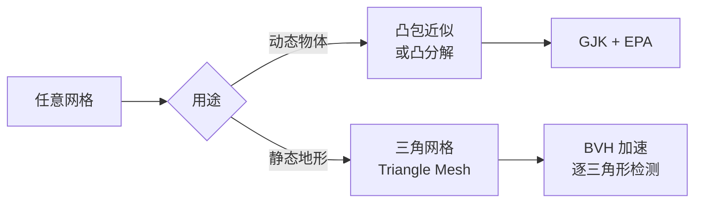
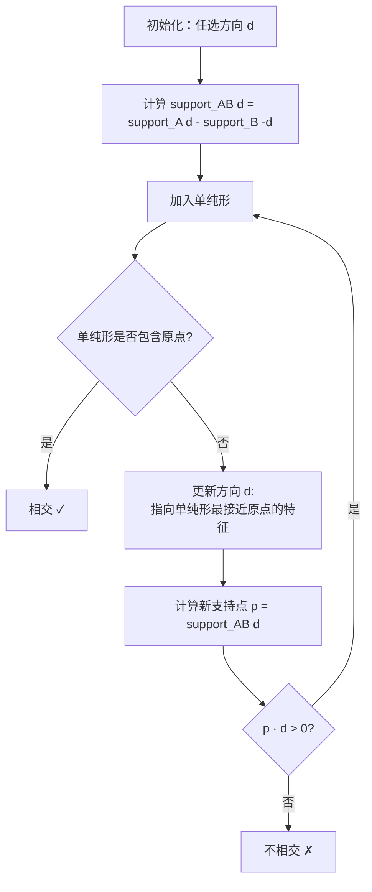
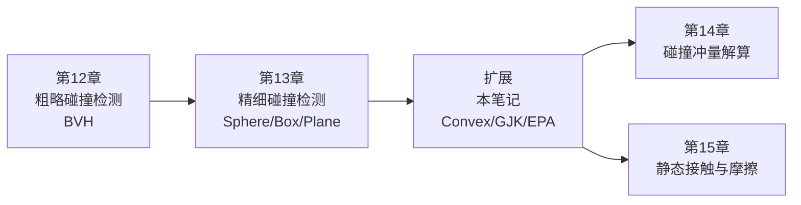

# 复杂碰撞检测：凸包、GJK 与 EPA

> 本笔记是对《Game Physics Engine Development》第 13 章的**延伸扩展**。  
> Cyclone 书中仅讲解了 Sphere/Box/Plane 的简单碰撞，但真实游戏引擎（Bullet/PhysX/Havok）面对的是**任意复杂几何体**。本笔记整理工业级物理引擎的核心碰撞检测方案。

---

## 一、问题背景：为什么需要更复杂的方案？

### 1.1 Cyclone 第 13 章的局限

第 13 章实现的是 **形状对形状的硬编码组合**：

| 组合 | 算法 |
|------|------|
| Sphere vs Sphere | 距离比较 |
| Sphere vs Plane | 投影距离 |
| Sphere vs Box | 最近点钳制 |
| Box vs Plane | 顶点测试 |
| Box vs Box | SAT（15 轴分离轴定理） |

**问题**：
- N 种形状需要 N² 种组合实现
- 真实游戏的角色、车辆、武器是**任意网格**，根本不是基本形状
- 美术导出的模型几何复杂（成百上千面）

### 1.2 工业级引擎的应对方案



---

## 二、为什么必须是凸包（Convex Hull）？

### 2.1 凸性的数学定义

**凸集**：集合内任意两点的连线仍在集合内。

```
凸：球、盒子、胶囊、任意凸多面体
凹：甜甜圈、L 形、角色（伸出四肢）
```

### 2.2 凸性带来的关键性质

#### (1) Support 函数 O(log n) 可计算

任意方向 d 上的"最远点"：

```
support(C, d) = argmax(p · d), p ∈ C
```

凸包的 Support 函数只需在**顶点**中找：
- 暴力 O(n)
- Hill Climbing 在邻接图上爬山 O(log n)

#### (2) 分离 ⇔ 不相交（必要充分）

> **凸集的分离定理**：两凸集不相交 ⟺ 存在一个超平面将其分开

这是 SAT、GJK 全部算法的数学基石。**凹形不成立**。

#### (3) 穿透深度有唯一最优定义

凸包之间的最小分离距离/穿透深度是**全局唯一**的，不会有"局部最小陷阱"。

#### (4) Minkowski 差仍是凸的

```
A ⊖ B = { a - b | a ∈ A, b ∈ B }
```

A、B 凸 ⟹ A⊖B 凸。这是 GJK 的工作空间。

**判定**：A 与 B 相交 ⟺ 原点 0 ∈ A⊖B

### 2.3 凹形怎么办？凸分解（Convex Decomposition）

```
凹形物体（如椅子、角色）
   ↓
拆分成多个凸包的并集
   ↓
每个凸包独立用 GJK 检测
   ↓
任一凸包与对方相交 → 整体相交
```

工具：
- **V-HACD**（开源）：自动近似凸分解
- **HACD**：分层近似凸分解
- 美术手动拆分（角色：头/胸/四肢各一个胶囊或凸包）

---

## 三、GJK 算法（Gilbert-Johnson-Keerthi）

### 3.1 核心思想

**判定两个凸体是否相交，等价于判定原点是否在 Minkowski 差 A⊖B 内**。

GJK 不构造完整的 A⊖B（成本太高），而是**用单纯形（Simplex）逐步逼近原点**。

### 3.2 算法流程



### 3.3 单纯形的演化

GJK 在 3D 中维护一个最多 4 个顶点的单纯形：

| 阶段 | 单纯形 | 几何 |
|------|--------|------|
| 1 | 1 点 | 点 |
| 2 | 2 点 | 线段 |
| 3 | 3 点 | 三角形 |
| 4 | 4 点 | 四面体 |

每次迭代：
1. 找出单纯形上**最接近原点**的特征（点/边/面）
2. 该特征的法向就是新的搜索方向 d
3. 用 d 求新支持点
4. 加入单纯形（如果是 4 点四面体则丢弃最远的点）

### 3.4 性能

- **平均 5~10 次迭代收敛**
- 每次迭代：2 次 Support 调用
- 总计 ~80~200 次浮点运算
- 与凸包顶点数几乎无关（!）

---

## 四、EPA 算法（Expanding Polytope Algorithm）

### 4.1 GJK 的局限

GJK 只能回答 **"是否相交"**，相交时**不能给出穿透深度和接触法线**。

但物理解算（Cyclone 第 14 章）需要：
- 接触法线 n
- 穿透深度 δ
- 接触点 p

### 4.2 EPA 思想

GJK 终止时得到一个**包含原点的四面体**（在 A⊖B 中）。EPA 在此基础上：

```
1. 把四面体作为初始多面体
2. 找出多面体上最接近原点的面 f
3. 沿 f 的法线 n 求新支持点 p
4. 如果 p 远于 f 到原点的距离 → 把 p 加入多面体（细分 f）
5. 否则 f 就是最优面 → 法线 n、深度 = f 到原点的距离
```

### 4.3 GJK + EPA 完整管线

```
凸包 A、凸包 B
   ↓ GJK
是否相交？
   ↓ 是
四面体 ⊃ 原点
   ↓ EPA
最近面 + 法线 + 深度
   ↓
还原接触点：用重心坐标反推 A、B 上的对应点
   ↓
Contact { point, normal, penetration } → 提交解算器
```

---

## 五、Triangle Mesh（静态地形）

### 5.1 用途

地形、建筑、固定关卡几何 —— 不需要变形也不需要"内部"。

### 5.2 工作流程

```
TriMesh = 大量三角形的集合 + BVH 加速结构
         (不要求凸性)
   ↓
动态物体（凸包） vs TriMesh
   ↓
1. BVH 剔除：用动态物体的 AABB 查询 BVH
2. 命中的三角形列表
3. 凸包 vs 每个三角形 → SAT 或 GJK
4. 收集所有接触点
```

### 5.3 致命缺陷：共享边的虚假法线

```
三角形 1 法线 n1 ─┐
                 ├─ 共享边
三角形 2 法线 n2 ─┘

物体滑过共享边时：
法线突然从 n1 跳变到 n2
→ 物理响应不连续，物体"弹起"或"卡住"
```

**解决方案**：边法线平滑（Edge Normal Smoothing）、Embree 的 watertight 检测、Bullet 的 internalEdgeUtility。

### 5.4 限制

- ✅ 仅用于**静态**几何
- ❌ 不能用于动态物体（性能 O(T²)、共享边问题、深度嵌入漏检）

---

## 六、组合策略：Compound + Convex Decomposition + Mesh

工业引擎的**完整方案**：

| 物体类型 | 推荐方案 | 理由 |
|---------|---------|------|
| 简单道具（箱子、球） | 单一 Box/Sphere/Capsule | 最快 |
| 角色 | Compound（多胶囊/凸包） | 兼顾性能与拟合 |
| 复杂动态物体（家具） | V-HACD 凸分解 | 自动化 |
| 静态地形/建筑 | Triangle Mesh + BVH | 唯一选择 |
| 极复杂凸包（>1000 面） | GJK + Hill Climbing | Support 加速 |

### 6.1 Compound Shape

物体由多个子形状组成（每个子形状有自己的局部 Transform）：

```cpp
struct CompoundShape {
    std::vector<SubShape> children;
    // 每个 SubShape: shape + localTransform
};
```

碰撞检测：每个子形状独立检测，结果合并。

### 6.2 角色的典型拼装

```
头：Sphere
胸/腹：Capsule × 2
上臂/前臂：Capsule × 4
大腿/小腿：Capsule × 4
```

11 个胶囊 → 既能拟合人体，又能用最快的 Capsule-Capsule 检测。

---

## 七、关键问答整理

### 7.1 为什么不能把凸包 B 拆成三角形，再做"凸包 A vs 三角形"？

这个问题非常深入，**答案是：方案能跑，但工程上是倒退**。

#### (1) 丢失"内部"信息 → 深度嵌入漏检

```
凸包 B（大盒子）
┌─────────────┐
│   ●A 小球   │  ← 完全嵌入 B 内部
└─────────────┘

逐三角形检测：A 不与任何三角形相交 → 漏检 ❌
GJK：原点 ∈ A⊖B → 正确判定相交 ✓
```

凸包是 **3D 实心体**，三角形是 **2D 面片**。拆解 = 维度降低 = 信息丢失。

#### (2) 性能下降数十~数百倍

| 凸包 B 复杂度 | 三角形数 T | GJK 标准 | 拆三角形 | 差距 |
|------------|----------|---------|---------|------|
| 盒子 | 12 | ~100 op | ~1200 op | 12× |
| 中等凸包 | 200 | ~200 op | ~20000 op | 100× |
| 复杂凸包 | 1000 | ~250 op | ~100000 op | 400× |

GJK 的迭代次数与凸包顶点数**几乎无关**，而拆三角形是线性 O(T)。

#### (3) 多三角形产生重复接触点

```
A 的一个面同时与 B 拆出的 4 个三角形相交
→ 4 个重复接触
→ 物理响应抽搐
```

GJK + EPA 给出**全局唯一**最优接触。

#### (4) 共享边法线退化

与 TriMesh 的共享边问题完全相同。GJK 在 Minkowski 差中工作，**无边界**。

### 7.2 TriMesh 也是逐三角形，为什么它能工作？

| 维度 | TriMesh（静态） | 凸包拆三角形 |
|------|---------------|------------|
| 整体形状 | 任意（可凹） | 凸（已经是凸包） |
| 是否有"内部" | 无（薄壳曲面） | 有（实心体积） |
| 嵌入风险 | 几乎无 | 高 |
| 替代方案 | 无（凹形不能 GJK） | 有（直接 GJK） |
| 用途 | 必须 | 自找麻烦 |

**TriMesh 的合理性**：地形是薄壳，物体不会"埋入地形内部"，且地形整体凹无法用 GJK，逐三角形是唯一选择。

**凸包拆三角形的不合理性**：本来可以用 GJK 一次解决，硬要拆解，主动放弃凸性。

### 7.3 GJK 为何不需要知道凸包的具体形状？

GJK 只通过 **Support 函数**访问凸包：

```cpp
Vector3 support(const ConvexShape& shape, const Vector3& dir);
```

这是一个**抽象接口**：
- 球：`center + dir.normalized() * radius`
- 盒子：`signs(dir) * halfSize`
- 凸包：遍历顶点找最远 / Hill Climbing
- 胶囊：球 + 线段的 Support 组合
- Minkowski 和：两个形状的 Support 相加

**任何凸形只要实现 Support 函数，就自动支持 GJK**。这就是 GJK 的优雅 —— 用一个统一接口处理所有凸形。

---

## 八、与 Cyclone 章节的关系



- **第 12 章**：BVH 树做粗略剔除（与本笔记中的 TriMesh BVH 同源）
- **第 13 章**：硬编码的形状对形状（本笔记的"基本款"）
- **本笔记**：扩展到任意凸形 / 凸分解 / TriMesh（工业级）
- **第 14、15 章**：用接触点做物理响应（不关心形状如何检测）

---

## 九、推荐学习路径

如果想深入实现这套方案：

1. **理论**
   - Christer Ericson《Real-Time Collision Detection》第 9 章（GJK 详解）
   - Gino van den Bergen《Collision Detection in Interactive 3D Environments》

2. **代码参考**
   - Bullet Physics 的 `btGjkPairDetector` 和 `btGjkEpaSolver2`
   - Box2D（2D 简化版 GJK）
   - 开源教程：[winter.dev 的 GJK 教程](https://winter.dev/articles/gjk-algorithm)

3. **工具**
   - V-HACD：自动凸分解
   - Embree / OptiX：BVH 加速

---

## 十、一句话精华

> **凸性是 GJK/EPA 的基石，Support 函数是统一接口，Minkowski 差是工作空间。  
> 凸包不能拆成三角形 —— 那等于把 3D 体积降维为 2D 面片，丢失内部信息、性能倒退、接触点重复。  
> Triangle Mesh 仅适用于静态薄壳地形，不能套用到动态凸体。  
> Compound + 凸分解 + TriMesh 三者组合，构成工业级物理引擎的完整碰撞检测方案。**
