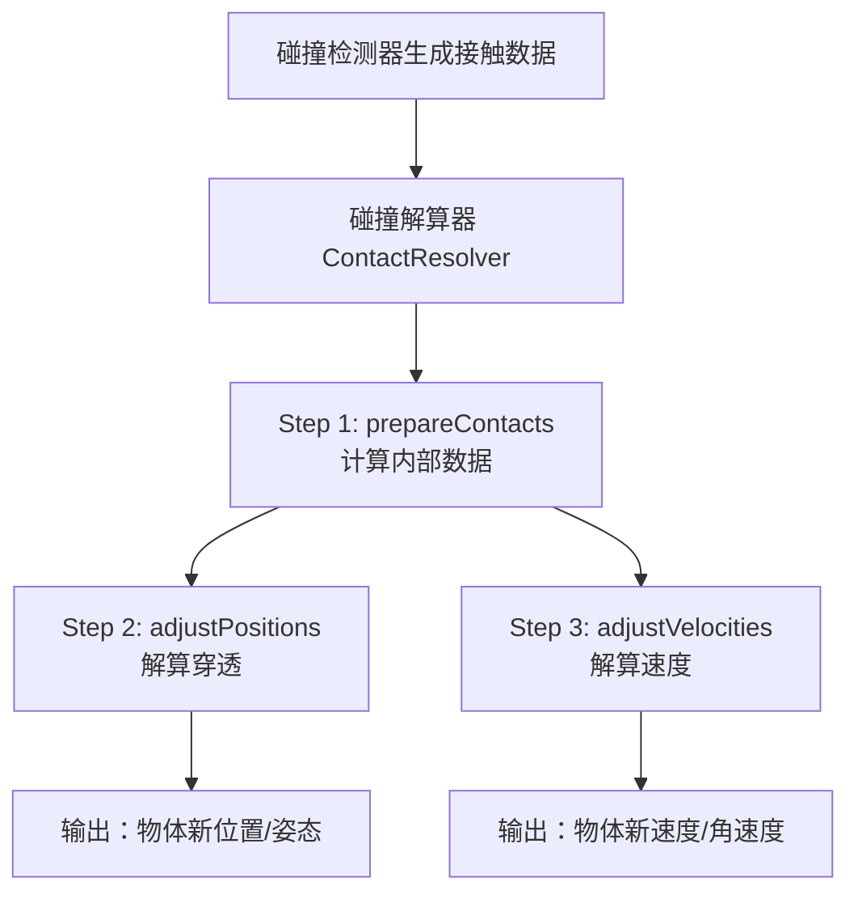
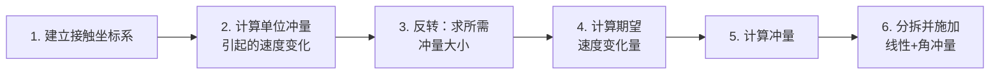
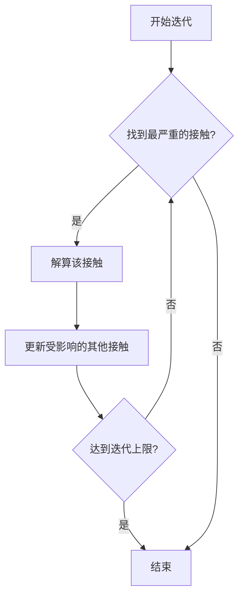
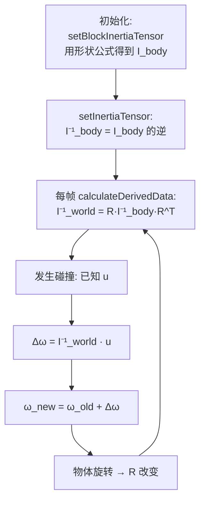

# 第14章 碰撞解算（Collision Resolution）精读 & 延伸知识

> 配套书籍：《Game Physics Engine Development》—— Ian Millington  
> 配套引擎：Cyclone（本仓库 `f:\Work\cyclone-physics`）  
> 整理时间：2026-06  
> 包含：第14章核心精读 + 围绕该章节展开的物理/数学/工程发散讨论

---

## 目录

- [一、第14章核心精读](#一第14章核心精读)
  - [1.1 章节地位与目标](#11-章节地位与目标)
  - [1.2 关键概念：冲量与冲量力矩](#12-关键概念冲量与冲量力矩)
  - [1.3 碰撞解算 6 步流程](#13-碰撞解算-6-步流程)
  - [1.4 穿透解算的四种方法](#14-穿透解算的四种方法)
  - [1.5 整体解算架构](#15-整体解算架构)
  - [1.6 关键设计决策](#16-关键设计决策)
- [二、核心公式精讲：冲量力矩](#二核心公式精讲冲量力矩)
  - [2.1 公式与单位](#21-公式与单位)
  - [2.2 叉积的几何含义](#22-叉积的几何含义)
  - [2.3 棍子撞地的实例分析](#23-棍子撞地的实例分析)
- [三、力矩为什么沿"旋转轴方向"](#三力矩为什么沿旋转轴方向)
  - [3.1 旋转的二维本质](#31-旋转的二维本质)
  - [3.2 力矩参与计算的方式](#32-力矩参与计算的方式)
  - [3.3 完整数值示例](#33-完整数值示例)
- [四、角速度也是向量](#四角速度也是向量)
  - [4.1 角速度向量的定义](#41-角速度向量的定义)
  - [4.2 与线速度的关系](#42-与线速度的关系)
  - [4.3 极向量 vs 轴向量](#43-极向量-vs-轴向量)
- [五、惯性张量与逆惯性张量](#五惯性张量与逆惯性张量)
  - [5.1 为什么需要张量而不是标量](#51-为什么需要张量而不是标量)
  - [5.2 惯性张量的数学定义](#52-惯性张量的数学定义)
  - [5.3 常见物体公式表](#53-常见物体公式表)
  - [5.4 为什么要"求逆"](#54-为什么要求逆)
  - [5.5 局部坐标 vs 世界坐标](#55-局部坐标-vs-世界坐标)
  - [5.6 在 Cyclone 中的实现](#56-在-cyclone-中的实现)
- [六、张量的数学定义](#六张量的数学定义)
  - [6.1 三种视角](#61-三种视角)
  - [6.2 数组视角](#62-数组视角)
  - [6.3 物理视角（变换规则）](#63-物理视角变换规则)
  - [6.4 数学视角（多重线性映射）](#64-数学视角多重线性映射)
  - [6.5 三种视角的统一](#65-三种视角的统一)
- [七、物理仿真的历史传承](#七物理仿真的历史传承)
  - [7.1 17-18 世纪：奠基](#71-17-18-世纪奠基)
  - [7.2 19 世纪：力学的数学化](#72-19-世纪力学的数学化)
  - [7.3 20 世纪：从理论到计算机](#73-20-世纪从理论到计算机)
  - [7.4 现代游戏物理引擎](#74-现代游戏物理引擎)
  - [7.5 传承图谱](#75-传承图谱)

---

## 一、第14章核心精读

# 📖 《Game Physics Engine Development》目录索引

## 全书结构（共481页PDF，6部分18章）

| 部分 | 章节 | 标题 | 书页 |
|------|------|------|------|
| **Part I: Particle Physics** | Ch1 | Introduction | 1 |
| | Ch2 | The Mathematics of Particles | 15 |
| | Ch3 | The Laws of Motion | 43 |
| | Ch4 | The Particle Physics Engine | 55 |
| **Part II: Mass-Aggregate Physics** | Ch5 | Adding General Forces | 69 |
| | Ch6 | Springs and Springlike Things | 81 |
| | Ch7 | Hard Constraints | 103 |
| | Ch8 | The Mass-Aggregate Physics Engine | 133 |
| **Part III: Rigid-Body Physics** | Ch9 | The Mathematics of Rotations | 145 |
| | Ch10 | Laws of Motion for Rigid Bodies | 193 |
| | Ch11 | The Rigid-Body Physics Engine | 213 |
| **Part IV: Collision Detection** | Ch12 | Collision Detection | 231 |
| | Ch13 | Generating Contacts | 263 |
| **Part V: Contact Physics** | **Ch14** | **Collision Resolution** | **301** |
| | Ch15 | Resting Contacts and Friction | 351 |
| | Ch16 | Stability and Optimization | 375 |
| | Ch17 | Putting It All Together | 399 |
| **Part VI: What Comes Next?** | Ch18 | Other Types of Physics | 423 |
| **Appendices** | A-D | Inertia Tensors, Friction Coefficients, Languages, Math Summary | 431-443 |

---

# 🔬 第14章精读：Collision Resolution（碰撞解算）

> **页码范围**：301-349（全书最长、数学最复杂的一章）  
> **核心目标**：将碰撞检测器生成的接触数据，与刚体运动方程结合，让旋转物体正确响应碰撞。

---

## 一、章节总览与流程图



---

## 二、14.1 冲量与冲量力矩（Impulses and Impulsive Torques）

### 核心物理概念

碰撞发生时，材料微小压缩产生恢复力，整个过程极短（毫秒级），我们将其建模为**瞬时速度变化**——即**冲量（Impulse）**。

对于旋转刚体，碰撞不仅改变线速度，还改变角速度。角速度的瞬时变化称为**冲量力矩（Impulsive Torque）**。

### 关键公式

| 公式 | 含义 |
|------|------|
| $u = p_f \times g$ | 冲量力矩 = 接触点相对位置 × 冲量 |
| $\Delta\dot{\theta} = I^{-1}u$ | 角速度变化 = 逆惯性张量 × 冲量力矩 |
| $v'_s = -c \cdot v_s$ | 分离速度 = -恢复系数 × 闭合速度 |

### 旋转碰撞的三种典型情况

1. **轻物体正面碰撞**：力矩小（$f$ 几乎平行于 $p_f$），主要产生线性弹跳
2. **重物体偏心碰撞 + 小转动惯量**：大力矩 → 大旋转响应，线性分量小（如尺子落地旋飞但不弹起）
3. **重物体偏心碰撞 + 大转动惯量**：旋转困难，主要线性弹跳

---

## 三、14.2 碰撞冲量计算（6步流水线）

这是本章最核心的算法，分6步完成：



### 14.2.1 接触坐标系（Contact Coordinates）

- **X轴** = 接触法线（由碰撞检测器给出）
- **Y轴、Z轴** = 通过正交化算法计算
- 用 3×3 **基矩阵** `contactToWorld` 在接触坐标与世界坐标之间转换
- 逆变换 = 转置（因为是纯旋转矩阵）

关键代码：`Contact::calculateContactBasis()` 中根据法线方向选择世界Y轴或X轴作为初始猜测，手动展开叉积以提高效率。

### 14.2.2 单位冲量引起的速度变化

对每个物体，计算**线性分量**和**角分量**：

```
线性分量 = 逆质量 m⁻¹
角分量 = (q_rel × d) → I⁻¹变换 → 再 × q_rel → 投影到法线方向
```

代码核心：
```cpp
Vector3 deltaVelWorld = relativeContactPosition[0] % contactNormal;
deltaVelWorld = inverseInertiaTensor[0].transform(deltaVelWorld);
deltaVelWorld = deltaVelWorld % relativeContactPosition[0];
real deltaVelocity = deltaVelWorld * contactNormal;  // 角分量
deltaVelocity += body[0]->getInverseMass();          // 线性分量
```

### 14.2.3 由速度变化反求冲量

对于无摩擦碰撞，极其简单：

$$g = \frac{\Delta v}{d}$$

其中 $d$ 是上一步算出的"单位冲量引起的总速度变化"。

#### 为什么不直接算速度，而是绕一圈反求冲量？

直觉上 $g = m \cdot (1+c) \cdot v_s$ 似乎够了，但这**只对质点撞墙的最简单情况成立**。

**核心问题：两物体碰撞时，速度变化怎么分配？**

碰撞定律 $v'_s = -c \cdot v_s$ 只给出**1个约束**（接触点的相对法向速度），但要确定**4个未知数**：

- 物体 A 的线速度变化 $\Delta\vec{v}_A$
- 物体 A 的角速度变化 $\Delta\vec{\omega}_A$
- 物体 B 的线速度变化 $\Delta\vec{v}_B$
- 物体 B 的角速度变化 $\Delta\vec{\omega}_B$

**冲量是"降维"的桥梁**：根据牛顿第三定律，A 收 $+g$，B 收 $-g$，**1 个未知数**就唯一确定了所有 4 个量：

```
Δv_A = +g / m_A          Δω_A = I_A⁻¹ · (r_A × g)
Δv_B = -g / m_B          Δω_B = I_B⁻¹ · (r_B × (-g))
```

这样**自动满足**：动量守恒、角动量守恒、牛顿第三定律。然后用碰撞定律这个唯一约束求解 $g$。

#### 为什么 $g = m(1+c)v_s$ 是错的？

该公式忽略了**冲量同时产生旋转**这一事实。冲量打在偏心位置时：

- 一部分变成线速度（$\Delta v = g/m$）
- 一部分变成角速度 → 在接触点也贡献额外的线速度

所以**单位冲量引起的接触点速度变化 $d \neq 1/m$**，而是 $d = 1/m_A + 1/m_B + (\text{角度贡献})$。

冲量"更高效"了 → 同样的速度变化所**需的冲量比 $m(1+c)v_s$ 更小**。

反例：长棍子末端碰地，若用 $g = m(1+c)v_s$ 施加冲量 → 接触点的分离速度会**远超** $-c \cdot v_s$ → 违反碰撞定律。

### 14.2.4 计算期望速度变化

$$\Delta v_s = -(1+c) \cdot v_s$$

即：移除全部闭合速度，再加上恢复系数比例的反弹速度。

#### $\Delta v$ 的完整推导链

这个 $\Delta v$ 不是凭空出现的，从牛顿碰撞定律推导：

$$\Delta v_s = v'_s - v_s = (-c \cdot v_s) - v_s = -(1+c) \cdot v_s$$

**为什么是 $-(1+c)$ 不是 $-c$？** 速度变化分两部分：

1. 先把闭合速度抹掉：$-v_s$
2. 再加上反向分离速度：$-c \cdot v_s$

**$v_s$（当前闭合速度）的来源**：从两个物体接触点的实际速度差，投影到法线方向：

$$v_s = \big[(\vec{v}_A + \vec{\omega}_A \times \vec{r}_A) - (\vec{v}_B + \vec{\omega}_B \times \vec{r}_B)\big] \cdot \hat{n}$$

Cyclone 中的对应代码（`Contact::calculateDesiredDeltaVelocity`）：

```cpp
// 接触坐标系 X 分量 = v_s（当前闭合速度，标量）
real velocityFromAcc = ...; // 上帧加速度造成的部分（消除微抖动）
desiredDeltaVelocity = -contactVelocity.x * (1 + restitution) - velocityFromAcc;
```

**完整逻辑链**：

```
物体当前状态(v, ω, r)
      ↓
  接触点速度 v + ω × r
      ↓
  闭合速度 v_s = (相对速度)·n̂
      ↓
  期望变化 Δv = -(1+c)·v_s    ← 14.2.4
      ↓
  反求冲量 g = Δv / d           ← 14.2.3
      ↓
  分拆施加到 A、B 的线速度+角速度
```

### 14.2.5-14.2.6 计算并施加冲量

```cpp
// 接触坐标中的冲量
impulseContact.x = desiredDeltaVelocity / deltaVelocity;
impulseContact.y = 0;  // 无摩擦
impulseContact.z = 0;

// 转换到世界坐标
Vector3 impulse = contactToWorld.transform(impulseContact);

// 施加：线速度变化
body->velocity += impulse * inverseMass;

// 施加：角速度变化
Vector3 impulsiveTorque = impulse % relativeContactPosition;
body->rotation += inverseInertiaTensor.transform(impulsiveTorque);
```

**注意**：第二个物体接收方向相反的冲量（`impulse *= -1`）。

---

## 四、14.3 穿透解算（Resolving Interpenetration）

### 14.3.0 穿透问题的根源与必要性

#### 穿透从何而来？——离散时间模拟的"原罪"

物理引擎按固定步长（如 1/60 秒）推进，帧与帧之间物体是"瞬移"的：

```
第 N 帧:                 第 N+1 帧:
  ●  球 v=10m/s
  ↓                                       
══════════ 地面          ══════●════ 球穿入地面
```

碰撞检测器**总是事后**才检测到碰撞——这意味着穿透**不可避免**。原因有三：

1. 离散时间步长（碰撞瞬间通常落在两帧之间）
2. 碰撞检测的事后性质
3. 浮点误差累积

**穿透不是 bug，是结构性事实**——必须有专门机制补救。

#### 为什么光靠速度解算（14.2）不够？

速度解算只修改"未来"（运动趋势），不修改"当前"（位置事实）。如果只反弹速度而不挪位置：

```
第 N 帧: 速度反弹 → 物体还嵌在墙里
第 N+1 帧: 检测到还在碰撞 → 又反弹一次 → 颤抖!
```

三大灾难：
- **物体嵌在墙里抽搐**：每帧都触发碰撞解算，看起来像鬼附身
- **高速隧穿放大**：速度反弹来不及阻止下一帧继续穿
- **堆叠物体崩塌**：每帧 1mm 浮点穿透累积，叠的盒子永远抖动

#### 为什么穿透解算与速度解算必须**分开**做？

| 维度 | 速度解算（14.2） | 穿透解算（14.3） |
|------|----------------|------------------|
| **修改对象** | 速度 $\vec{v}$、角速度 $\vec\omega$ | 位置 $\vec{p}$、姿态 $\vec{q}$ |
| **物理依据** | 牛顿碰撞定律（恢复系数） | **无物理依据**（纯视觉补救） |
| **是否守恒** | 满足动量守恒 | 凭空挪动，不可逆 |
| **数学性质** | 严格的冲量法 | 启发式几何投影 |

**关键认知**：穿透解算**不是物理，是视觉补救**。混在一起会污染物理纯净性，且导致数值不稳定（位置变 → 速度变 → 穿透又变 → 死循环）。

#### 为什么先解位置再解速度？

Cyclone 的顺序：`adjustPositions` → `adjustVelocities`。

```
先速度后位置: 速度反弹 → 位置仍穿透 → 下一帧再触发 → 抖动
先位置后速度: 物体先分离 → 速度反弹 → 下一帧已分开 → 干净
```

### 四种方法对比

| 方法 | 优点 | 缺点 |
|------|------|------|
| **线性投影** | 简单快速 | 物体抽搐，不真实（棍子"传送"出地面，无旋转） |
| **基于速度的回退** | 较真实 | 引入虚假摩擦，多接触几乎无解 |
| **非线性投影** ✅ | 真实、不引入摩擦 | 需要限制旋转量 |
| **松弛法** | 多接触更均匀 | 单接触时残留穿透 |

Cyclone 采用**非线性投影 + 迭代松弛**：按惯性比例同时分配线性移动和角度移动。

### 非线性投影实现

核心思想：用与速度解算相同的数学，计算每个物体的**线性移动量**和**角移动量**的比例：

```cpp
// 角惯性（抵抗旋转的程度）
angularInertia[i] = (q_rel × n → I⁻¹变换 → × q_rel → · n)
// 线性惯性
linearInertia[i] = inverseMass

// 按比例分配穿透深度
linearMove[0] = penetration * linearInertia[0] / totalInertia;
angularMove[0] = penetration * angularInertia[0] / totalInertia;
```

### 避免过度旋转

限制角移动量不超过物体尺寸的固定比例（约0.2倍）：
```cpp
real limit = 0.2 * relativeContactPosition.magnitude();
if (abs(angularMove) > limit) {
    angularMove = clamp(angularMove, -limit, limit);
    linearMove = totalMove - angularMove;  // 多余部分转为线性
}
```

---

## 五、14.4 碰撞解算流程（The Resolution Process）

### 整体架构

```cpp
class ContactResolver {
    void resolveContacts(Contact* contacts, unsigned numContacts, real duration) {
        prepareContacts(contacts, numContacts, duration);   // 预计算
        adjustPositions(contacts, numContacts, duration);   // 解穿透
        adjustVelocities(contacts, numContacts, duration);  // 解速度
    }
};
```

### 预计算阶段（prepareContacts）

为每个接触计算：
- 接触基矩阵 `contactToWorld`
- 相对接触位置 `relativeContactPosition[2]`
- 接触速度 `contactVelocity`（含线性+角速度贡献）
- 期望速度变化 `desiredDeltaVelocity`

### 迭代解算策略

穿透和速度都采用**按严重程度排序的迭代算法**：



### 更新其他接触的穿透深度

解算一个接触后，只更新**共享同一物体**的其他接触：

```cpp
// 如果接触i的body[0]就是刚被移动的物体
cp = rotationChange.vectorProduct(c[i].relativeContactPosition[0]);
cp += velocityChange;
c[i].penetration -= rotationAmount * cp.scalarProduct(c[i].contactNormal);
```

### 性能讨论

作者实验了6种排序/链表优化方案，结论是：
- **少量接触**：朴素遍历更快（无额外指针开销）
- **数百个紧密堆叠接触**：链表排序版本显著更快
- **游戏开发建议**：先profile再优化

---

## 六、关键设计决策总结

| 决策 | 选择 | 原因 |
|------|------|------|
| 解算策略 | 逐个顺序解算（非同时） | 简单、快速，适合大多数游戏 |
| 穿透解算 | 非线性投影 | 视觉真实，不引入虚假摩擦 |
| 迭代顺序 | 最严重优先 | 保证最明显的问题先解决 |
| 摩擦 | 本章不处理 | 留给第15章 |
| 坐标系 | 接触坐标系 | 简化数学，法线方向=X轴 |

---

## 七、本章遗留问题（下两章解决）

1. **无摩擦** → 第15章引入库仑摩擦
2. **静止接触振动** → 第15章微碰撞 + 第16章休眠机制
3. **性能** → 第16章 Sleep、Contact Grouping 等优化

---

这一章是全书**数学最密集、实现最复杂**的章节，但也是物理引擎的核心——理解了冲量如何在接触坐标系中分解为线性和角分量，就掌握了刚体碰撞响应的精髓。
---

## 二、核心公式精讲：冲量力矩

### 2.1 公式与单位

$$\vec{u} = \vec{p_f} \times \vec{g}$$

| 符号 | 含义 | 单位 |
|------|------|------|
| $\vec{p_f}$ | 接触点相对质心的位置向量 | m |
| $\vec{g}$ | 冲量 | N·s = kg·m/s |
| $\vec{u}$ | **冲量力矩** | **kg·m²/s** |

冲量力矩的单位 **kg·m²/s** 与角动量单位完全一致——这不是巧合，因为：

$$\vec{u} = \int \vec{\tau} \, dt = \Delta \vec{L}$$

冲量力矩就是**角动量的瞬时变化量**。

### 2.2 叉积的几何含义

公式中的 "×" 是 **向量叉积**（不是标量乘法）：

```
模长：|u| = |p_f| · |g| · sin(θ)
方向：垂直于 p_f 和 g 张成的平面（右手定则）
```

为什么是这个公式？因为 $\vec{p_f}$ 实际上扮演**力臂**的角色——叉积自动处理了"垂直分量"：

- 若冲量方向 $\vec{g}$ 与位置 $\vec{p_f}$ 平行（撞在质心连线上）→ 叉积为 0 → 不产生力矩 → 物体不旋转
- 若冲量方向与位置垂直（撞在最外端）→ 叉积最大 → 力矩最大 → 物体旋转最剧烈

这正是杠杆原理的向量化版本。

### 2.3 棍子撞地的实例分析

场景：一根斜着的棍子撞地。

- $\vec{p_f}$（绿色）：从质心指向接触点，方向是"右下方"
- $\vec{g}$（绿色）：地面给的冲量，沿接触法线**竖直向上**
- $\vec{u}$（冲量力矩）：**垂直于纸面**，指向屏幕外（按右手定则）

**重要澄清**：

> 冲量力矩 $\vec{u}$ 是**轴向量**，代表**旋转轴方向**，而不是某个平移方向。它**永远不会**位于 $\vec{p_f}$ 和 $\vec{g}$ 所在的平面内。

物理直觉：地面"踢"一下棍子的下端 → 棍子绕一个**水平、出屏幕的轴**翻倒 → 这个轴就是 $\vec{u}$ 的方向。

---

## 三、力矩为什么沿"旋转轴方向"

### 3.1 旋转的二维本质

一个旋转必须发生在**某个平面内**。要描述旋转，需要三个信息：

1. 旋转所在的**平面**
2. 旋转的**方向**（顺/逆时针）
3. 旋转的**强度**

数学家用一个向量同时编码这三件事的巧妙办法：

| 信息 | 向量编码 |
|------|---------|
| 旋转平面 | 用其**法线方向**代表 |
| 旋转方向 | 用**右手定则**（四指顺转动方向，拇指=向量指向） |
| 旋转强度 | 向量的**长度** |

所以"力矩沿旋转轴方向"不是一个物理事实，而是一种**聪明的数学表示法**——把"绕某平面旋转"这件事，用"垂直于平面的向量"来代替。

### 3.2 力矩参与计算的方式

牛顿第二定律的"旋转版本"：

| 平移版本 | 旋转版本 |
|---------|---------|
| $\vec{F} = m\vec{a}$ | $\vec{\tau} = \mathbf{I}\vec{\alpha}$ |
| $\vec{F} \cdot dt = m \cdot d\vec{v}$ | $\vec{\tau} \cdot dt = \mathbf{I} \cdot d\vec{\omega}$ |
| 冲量 $\vec{g} = m\Delta\vec{v}$ | 冲量力矩 $\vec{u} = \mathbf{I}\Delta\vec{\omega}$ |

**Cyclone 中的对应代码**（来自 `Contact::applyVelocityChange`）：

```cpp
// Step 1: 计算冲量力矩 u = p_f × g
Vector3 impulsiveTorque = relativeContactPosition[0] % impulse;
//                                                    ↑
//                                          Cyclone 重载 % 为叉积

// Step 2: Δω = I⁻¹ · u
rotationChange[0] = inverseInertiaTensor[0].transform(impulsiveTorque);

// Step 3: ω_new = ω_old + Δω
body[0]->addRotation(rotationChange[0]);
```

### 3.3 完整数值示例

棍子撞地：
- $\vec{p_f} = (0.5, -1, 0)$ m
- $\vec{g} = (0, 5, 0)$ N·s

**算冲量力矩**：

$$\vec{u} = \begin{vmatrix} \hat{i} & \hat{j} & \hat{k} \\ 0.5 & -1 & 0 \\ 0 & 5 & 0 \end{vmatrix} = (0, 0, 2.5) \text{ kg·m}^2/\text{s}$$

→ 沿 +Z 轴（出屏幕）→ 棍子绕水平的、出屏幕的轴翻倒 ✓

**算角速度变化**（设绕Z轴的转动惯量倒数为 $1/I_{zz}$）：

$$\Delta\vec{\omega} = \mathbf{I}^{-1} \vec{u} = (0, 0, 2.5/I_{zz})$$

→ 棍子获得绕 Z 轴的角速度，开始翻倒。

---

## 四、角速度也是向量

### 4.1 角速度向量的定义

| 角速度向量的组成 | 物理含义 |
|----------------|---------|
| **方向** | 旋转轴的方向 |
| **指向**（朝哪头） | 右手定则：四指顺转动方向，拇指 = 向量指向 |
| **长度（模）** | 角速度大小（rad/s） |

### 4.2 与线速度的关系

刚体上某点 $\vec{r}$（相对质心）的线速度：

$$\vec{v} = \vec{\omega} \times \vec{r}$$

**完整接触点速度公式**：

$$\vec{v}_{接触点} = \vec{v}_{质心} + \vec{\omega} \times \vec{r}$$

**Cyclone 中的实现**（`Contact::calculateLocalVelocity`）：

```cpp
Vector3 velocity = body->getRotation() % relativeContactPosition;
//                       ↑                       ↑
//                    角速度 ω              接触点位置 r
//                                         ω × r：旋转贡献的线速度
velocity += body->getVelocity();  // 再加上质心线速度
```

这就是为什么角速度必须是**向量**——它要参与叉积，把"旋转"翻译成"接触点的实际线速度"。

### 4.3 极向量 vs 轴向量

| 物理量 | 类型 | Cyclone 字段 |
|-------|------|---------------|
| 位置 $\vec{r}$ | 极向量 | `position` |
| 线速度 $\vec{v}$ | 极向量 | `velocity` |
| 力 $\vec{F}$ | 极向量 | `forceAccum` |
| **角速度 $\vec{\omega}$** | **轴向量** | **`rotation`** |
| **力矩 $\vec{\tau}$** | **轴向量** | **`torqueAccum`** |
| **冲量力矩 $\vec{u}$** | **轴向量** | （局部变量） |

**轴向量的特殊性**：在镜像反射变换下，方向不变（多一次反号）。99% 情况不影响游戏开发，但做手性变换（左右手坐标系转换）时要注意。

---

## 五、惯性张量与逆惯性张量

### 5.1 为什么需要张量而不是标量

二维情况下，转动惯量是标量 $I = \sum_i m_i r_i^2$。

但**三维情况下**，物体绕不同轴旋转的难度不同：

```
   长棍子                       
      │                          
      │  ← 绕长轴转: 容易（I小）
      │                          
   ════╪════ ← 绕短轴转: 困难（I大）
      │                          
```

所以必须用 **3×3 矩阵**——这就是**惯性张量** $\mathbf{I}$。

### 5.2 惯性张量的数学定义

$$\mathbf{I} = \begin{pmatrix} I_{xx} & I_{xy} & I_{xz} \\ I_{xy} & I_{yy} & I_{yz} \\ I_{xz} & I_{yz} & I_{zz} \end{pmatrix}$$

**对角元（绕该轴的转动惯量）**：

$$I_{xx} = \int (y^2 + z^2) \, dm \quad I_{yy} = \int (x^2 + z^2) \, dm \quad I_{zz} = \int (x^2 + y^2) \, dm$$

**非对角元（惯性积，描述耦合）**：

$$I_{xy} = -\int xy \, dm \quad I_{xz} = -\int xz \, dm \quad I_{yz} = -\int yz \, dm$$

**关键性质**：在物体局部坐标系下（几何主轴对齐坐标轴），张量是**对角矩阵**，非对角元为 0。

### 5.3 常见物体公式表

| 物体 | $I_{xx}$ | $I_{yy}$ | $I_{zz}$ |
|------|----------|----------|----------|
| 实心球（半径r） | $\frac{2}{5}mr^2$ | $\frac{2}{5}mr^2$ | $\frac{2}{5}mr^2$ |
| 长方体（半边$a,b,c$） | $\frac{m}{3}(b^2+c^2)$ | $\frac{m}{3}(a^2+c^2)$ | $\frac{m}{3}(a^2+b^2)$ |
| 圆柱（半径r,高h，绕Z） | $\frac{m}{12}(3r^2+h^2)$ | $\frac{m}{12}(3r^2+h^2)$ | $\frac{1}{2}mr^2$ |
| 细杆（沿Z轴，长L） | $\frac{1}{12}mL^2$ | $\frac{1}{12}mL^2$ | $\approx 0$ |

**Cyclone 中长方体的实现**（[core.h](../../include/cyclone/core.h) `setBlockInertiaTensor`）：

```cpp
void setBlockInertiaTensor(const Vector3 &halfSizes, real mass)
{
    Vector3 squares = halfSizes.componentProduct(halfSizes);
    setInertiaTensorCoeffs(0.3f*mass*(squares.y + squares.z),
                           0.3f*mass*(squares.x + squares.z),
                           0.3f*mass*(squares.x + squares.y));
}
```

### 5.4 为什么要"求逆"

碰撞时**已知冲量力矩 $\vec{u}$，未知角速度变化 $\Delta\vec\omega$**，所以反推：

$$\Delta\vec{\omega} = \mathbf{I}^{-1} \cdot \vec{u}$$

**对角矩阵求逆**（绝大多数游戏物理）：直接对每个对角元求倒数：

$$\mathbf{I}_{body}^{-1} = \begin{pmatrix} 1/I_{xx} & 0 & 0 \\ 0 & 1/I_{yy} & 0 \\ 0 & 0 & 1/I_{zz} \end{pmatrix}$$

**Cyclone 直接存储逆矩阵**而非原矩阵——因为逆矩阵每帧都要用，而求逆是一次性操作。

### 5.5 局部坐标 vs 世界坐标

惯性张量描述的是**质量分布**——而质量分布会**跟着物体一起转**。

```
物体局部坐标(没旋转时):     物体旋转45度后:
     ┌───┐                         ◇
     │   │                         /  长方向变了!
     │ ●─┼─→ x轴                  ●     
     │   │                       /
     └───┘                      ◇
                                 → x轴
```

虽然**物体局部坐标**下惯性张量不变，但**世界坐标**下变了。

**变换公式**（相似变换）：

$$\mathbf{I}_{world} = R \cdot \mathbf{I}_{body} \cdot R^T$$

$$\mathbf{I}_{world}^{-1} = R \cdot \mathbf{I}_{body}^{-1} \cdot R^T$$

**三明治结构的物理直觉**：
1. $R^T \vec{u}_{world}$ — 把世界坐标力矩**转换到物体局部**
2. $\mathbf{I}^{-1}_{body} \cdot (\cdots)$ — 在物体局部用对角矩阵直接算
3. $R \cdot (\cdots)$ — 把局部角速度变化**转回世界坐标系**

### 5.6 在 Cyclone 中的实现

| 概念 | 数学符号 | Cyclone 字段 | 何时计算 |
|------|---------|------------|---------|
| 局部逆惯性张量 | $\mathbf{I}^{-1}_{body}$ | `inverseInertiaTensor` | 初始化时一次性求逆 |
| 世界逆惯性张量 | $\mathbf{I}^{-1}_{world}$ | `inverseInertiaTensorWorld` | 每帧 `calculateDerivedData` 重算 |
| 旋转矩阵 | $R$ | `transformMatrix` | 每帧由 `orientation` 重算 |

**完整流程**：



`_transformInertiaTensor` 函数（[body.cpp](../../src/body.cpp) 第39行）就是把 $R \cdot \mathbf{I}^{-1} \cdot R^T$ 手动展开的高度优化版本。

---

## 六、张量的数学定义

### 6.1 三种视角

| 视角 | 定义 | 适用人群 |
|------|------|---------|
| **数组视角** | 张量 = 多维数组 | 程序员、机器学习工程师 |
| **物理视角** | 在坐标变换下满足特定规则的量 | 物理学家、工程师 |
| **数学视角** | 多重线性映射 | 数学家、理论物理 |

三种定义最终等价，惯性张量主要用"物理视角"。

### 6.2 数组视角

| 阶数 | 名称 | 例子 | 数据结构 |
|------|------|------|---------|
| 0 | 标量 | 质量、温度 | 一个数 |
| 1 | 向量 | 速度、力 | `[3]` |
| 2 | 矩阵 | 惯性张量 | `[3][3]` |
| 3 | 三阶张量 | 压电张量 | `[3][3][3]` |
| 4 | 四阶张量 | 弹性张量 | `[3][3][3][3]` |

但这个定义不完整：**不是所有数组都是张量**——必须满足下面的变换规则。

### 6.3 物理视角（变换规则）

**核心思想**：张量是"在坐标变换下按特定线性规则协调变化"的量。

| 阶数 | 变换规则 |
|------|---------|
| 标量 | $T' = T$（不变） |
| 向量 | $\vec{v}' = R\vec{v}$ |
| 二阶张量 | $T' = R \, T \, R^T$ |
| N 阶张量 | 每多一阶多乘一次 R |

**这就是为什么惯性张量配得上"张量"这个名字**——它满足 $\mathbf{I}_{world} = R \cdot \mathbf{I}_{body} \cdot R^T$。

**关键洞察**：张量的本质是**几何对象**，分量值依赖于坐标系，但物体本身（这个对象）跟坐标系无关。

### 6.4 数学视角（多重线性映射）

$(p, q)$ 型张量是这样的映射：

$$T: \underbrace{V^* \times \cdots \times V^*}_{p\,\text{个}} \times \underbrace{V \times \cdots \times V}_{q\,\text{个}} \to \mathbb{R}$$

并且对每个变量都是**线性的**。

**惯性张量作为映射**：吃一个向量（角速度），吐一个向量（角动量）：

$$\mathbf{I}: V \to V, \quad \vec{\omega} \mapsto \vec{L} = \mathbf{I}\vec{\omega}$$

或作为双线性形式（与转动动能 $\frac{1}{2}\vec\omega^T \mathbf{I} \vec\omega$ 直接相关）：

$$\mathbf{I}(\vec\omega_1, \vec\omega_2) = \vec\omega_1^T \mathbf{I} \vec\omega_2$$

### 6.5 三种视角的统一

| 视角 | 关注点 | 例子（惯性张量） |
|------|--------|----------------|
| 数组 | "长什么样" | 3×3 矩阵 |
| 物理 | "如何变化" | 满足 $\mathbf{I}' = R\mathbf{I}R^T$ |
| 数学 | "做什么用" | 把角速度映射到角动量 |

**张量 vs 矩阵 vs 数组**：

- ✅ 所有张量都可以用数组表示
- ❌ 不是所有数组都是张量
- ✅ 二阶张量可以用矩阵表示
- ❌ 不是所有矩阵都是张量（比如旋转矩阵 $R$ 本身是变换不是张量）

**注**：机器学习中的"张量"（PyTorch/TensorFlow）严格说就是多维数组，不要求满足坐标变换规则——是术语滥用，但工程界已约定俗成。

---

## 八、总结

> **第 14 章的核心**：用冲量法在碰撞瞬间修正速度和角速度，用迭代式解算处理多接触点的相互影响，用非线性投影消除穿透。
>
> **冲量力矩公式 $\vec{u} = \vec{p_f} \times \vec{g}$ 的本质**：用一个轴向量编码"绕某平面旋转"这件事——方向是旋转轴，长度是旋转强度，按右手定则定指向。
>
> **逆惯性张量的来源**：物理建模 → 形状公式得到 $\mathbf{I}_{body}$ → 求逆 → 每帧用 $R \cdot \mathbf{I}^{-1}_{body} \cdot R^T$ 得到世界版本。
>
> **张量的本质**：在坐标变换下"协调变化"的几何对象，分量依赖坐标系，但物理意义不变。惯性张量同时满足"3×3 矩阵 / 满足 $RIR^T$ 变换 / 把 $\vec\omega$ 映射到 $\vec L$"三个特征。
>

---

## 附录：相关代码位置

| 主题 | 文件 | 行号 |
|------|------|------|
| 冲量力矩计算 | `src/contacts.cpp` | `Contact::applyVelocityChange` |
| 接触点速度 | `src/contacts.cpp` | `Contact::calculateLocalVelocity` |
| 长方体惯性张量 | `include/cyclone/core.h` | 966 (`setBlockInertiaTensor`) |
| 惯性张量求逆 | `src/body.cpp` | 237 (`setInertiaTensor`) |
| 世界坐标变换 | `src/body.cpp` | 39 (`_transformInertiaTensor`) |
| 每帧重算 | `src/body.cpp` | 147 (`calculateDerivedData`) |

